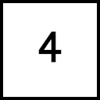
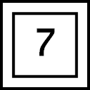

# Picross 3D

3d [nonograms](https://www.wikiwand.com/en/Nonogram) in the browser

## Features

- Puzzle Solver
- Puzzle Editor
- Multiple cell selection (drag mouse while down)
- .OBJ model to puzzle converter
- Export/Import puzzles to/from JSON

## How to play?

The aim of a puzzle is to remove blocks according to the given hints in order to reveal the underlying shape.

## Controls

Controls can be changed in the Settings > Controls menu

| Action         | Key (QWERTY) | Key (AZERTY) |
|----------------|--------------|--------------|
| Remove a block | W            | Z            |
| Paint a block  | A            | Q            |
| Add a block    | Q            | A            |

## Hints

There are three types of hints :

### Simple hints

Indicates that there are 4 consecutive blocks in the line.

### Circle hints

Indicates that there are 3 blocks in the line, split in 2 groups exactly. 

### Square hints

Indicates that there are 7 blocks in the line, split in at least 3 groups.

